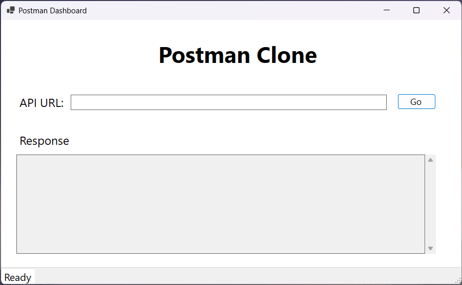
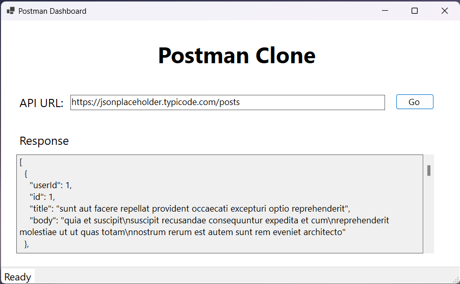

# Postman Clone

## Application Goal:
- Build a Windows Forms app that is a clone of the Postman app.
    - Postman is a tool for testing APIs by calling them from a user interface and reviewing the returned data.
- It should make GET requests to APIs and view the responses in formatted JSON.
- Ideal for developers and testers, this tool simplifies API interaction and debugging, helping you efficiently validate and troubleshoot your API calls.

## Technologies Used:
* C#
* .NET 8
* WinForms
* ClassLibrary
* HTTPClient
* JSON
* GIT

## Using The App:
1. Download the executable file from the release section.
2. When the application launches, it should look like this:

3. Fill in your API URL and hit 'Go' button:

4. Now you can hire me.

## Upcoming Changes:
* Adding POST, PUT, PATCH, and DELETE functionality.
* Adding API headers.
* Handling API Authentication.
* Adding Dependency Injection.
* Adding Logging.
* Create a web-based user interface for the application.

